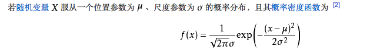
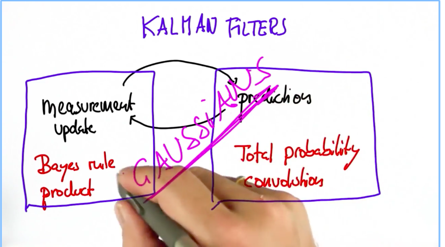
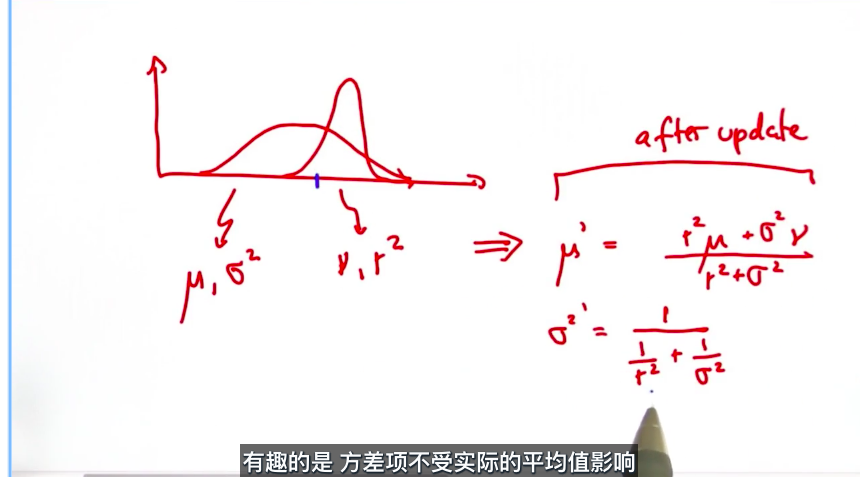
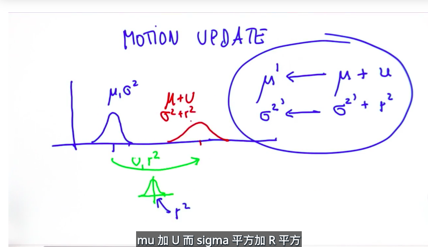
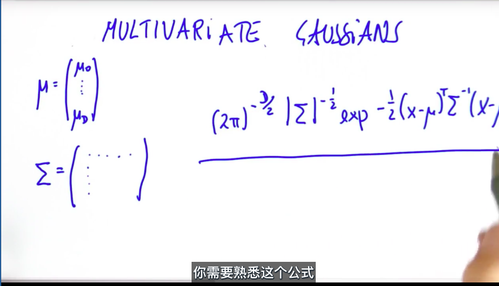

- 高斯分布

  > 一维高斯分布
  >
  > 
  >
  > 其中μ表示平均值，σ^2表示方差（**σ^2表示高斯函数的宽度，越大宽度越大，则数据越离散，越小宽度小，则数据越集中**），σ^2越大表示

- 总体上，卡尔曼滤波包括两部分，测量更新和运动更新

  

- 测量更新，根据先验分布和当前测量分布，进行融合求参数

  > 多元高斯融合求参数。
  >
  > 前一个分布函数为先验分布，后一个分布函数为当前测量分布。

  

  ```python
  def update(mean1, var1, mean2, var2):
      new_mean = (var2 * mean1 + var1 * mean2) / (var1 + var2)
      new_var = 1/(1/var1 + 1/var2)
      return [new_mean, new_var]
  ```

- 运动更新（预测）

  > 前一个分布（蓝色）为先验分布，后一个分布（红色）为计算后的分布，下方的分布（绿色）为运动本身的分布（其中v表示前进的距离，r平方表示误差）。
  >
  > 计算方式很简单，把先验分布和运动分布参数相加就可以了。

  

  ```python
  def predict(mean1, var1, mean2, var2):
      new_mean = mean1+mean2
      new_var =var1+var2
      return [new_mean, new_var]
  ```

- 整合测量更新和运动更新

  ```python
  def update(mean1, var1, mean2, var2):
      new_mean = float(var2 * mean1 + var1 * mean2) / (var1 + var2)
      new_var = 1./(1./var1 + 1./var2)
      return [new_mean, new_var]

  def predict(mean1, var1, mean2, var2):
      new_mean = mean1 + mean2
      new_var = var1 + var2
      return [new_mean, new_var]

  measurements = [5., 6., 7., 9., 10.]
  motion = [1., 1., 2., 1., 1.]
  measurement_sig = 4.
  motion_sig = 2.
  mu = 0.
  sig = 10000.

  for n in range(len(measurements)):
      [mu, sig] = update(mu, sig, measurements[n], measurement_sig)
      print("update", [mu, sig])
      [mu, sig] = predict(mu, sig, motion[n], motion_sig)
      print("predict", [mu, sig])
  ```

- 多元高斯分布

  > 其中u是一个向量，sigma是协方差矩阵。

  

  > 下面是一个二元高斯分布的例子
  >
  > 第一个图，如果是斜的，表示两个维度的不确定性是相关的。
  >
  > 第二个图，表示两个维度都很确定。
  >
  > 第三个图，表示x方向很确定，有方向很不确定。

  

  ​